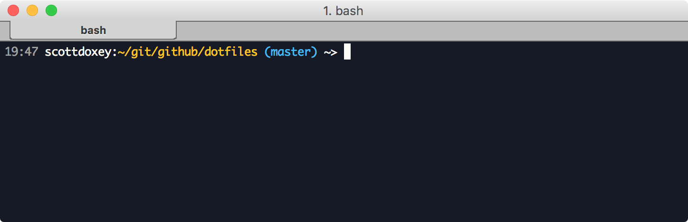

# dotfiles

> @neogeek's dotfiles

[](https://github.com/neogeek/dotfiles/actions/workflows/test.workflow.yml)



## Installation

You can store this repo in any directory you choose (I keep it with the rest of my git related projects in `~/git/github/`). Running the following command will pull the latest version of the dotfiles repo into a new folder and add a line to your `~/.bash_profile`.

```bash
$ git clone https://github.com/neogeek/dotfiles.git && cd dotfiles && source bootstrap.sh
```

## Updating

You can update the dotfiles at any time using the following command. It will pull any new updates from the repo and update the line in `~/.bash_profile` to the latest.

```bash
$ update.sh
```

## Commands

### CLI Aliases

#### Directory Listing

Show contents of current directory as a list with color.

```bash
$ ls
```

#### Simple HTTP Server

Run a python server with the static files in the current directory. Port defaults to 8000.

```bash
$ pyserver <port>
```

#### Delete node_modules/ and reinstall packages

```bash
$ npmplease
```

#### Python3

```bash
$ python
```

#### Python3 PIP

```bash
$ pip
```

### Git Aliases

#### Branches

```bash
$ git b
```

#### Branches (including remote)

```bash
$ git bb
```

#### Logs (with graph)

```bash
$ git l
```

#### Remotes

```bash
$ git r
```

#### Update Submodules

```bash
$ git sub
```

### Scripts

#### Brew

You can install and update [brew](http://brew.sh) and listed dependencies using the following command.

- [cloc](https://github.com/AlDanial/cloc/)
- [diff-so-fancy](https://github.com/so-fancy/diff-so-fancy)
- [git](https://git-scm.com/)
- [git-lfs](https://git-lfs.github.com/)
- [gpg](https://help.github.com/categories/gpg/)
- [imagemagick](http://www.imagemagick.org/script/index.php)
- [redis](https://redis.io/)
- [shellcheck](https://github.com/koalaman/shellcheck)

```bash
$ brew.sh
```

#### Cask

- [1password](https://www.1password.com/)
- [alfred](https://www.alfredapp.com/)
- [android-platform-tools](https://developer.android.com/studio/releases/platform-tools)
- [discord](https://discordapp.com/)
- [dropbox](https://www.dropbox.com/)
- [epic-games](https://www.epicgames.com/)
- [fontbase](http://fontba.se/)
- [fork](https://git-fork.com/)
- [github](https://desktop.github.com/)
- [gog-galaxy](https://www.gog.com/galaxy)
- [google-chrome](https://www.google.com/chrome/)
- [google-cloud-sdk](https://cloud.google.com/sdk/)
- [imageoptim](https://imageoptim.com/mac)
- [iterm2](https://www.iterm2.com/)
- [jetbrains-toolbox](https://www.jetbrains.com/toolbox-app/)
- [kap](https://github.com/wulkano/kap)
- [ngrok](https://ngrok.com/)
- [notion](https://notion.so/)
- [obs](https://obsproject.com/)
- [postico](https://eggerapps.at/postico/)
- [rotato](https://www.rotato.app/)
- [signal](https://signal.org/en/)
- [sketch](https://www.sketchapp.com/)
- [spotify](https://www.spotify.com/us/)
- [steam](http://store.steampowered.com/)
- [sublime-merge](https://www.sublimemerge.com/)
- [sublime-text](https://www.sublimetext.com/)
- [telegram](https://telegram.org/)
- [tunnelbear](https://www.tunnelbear.com/)
- [unity-hub](https://blogs.unity3d.com/2018/01/24/streamline-your-workflow-introducing-unity-hub-beta/)
- [visual-studio-code](https://code.visualstudio.com/)
- [zoom](https://zoom.us/)

```bash
$ cask.sh
```

#### Gem

You can install and update [rbenv](https://github.com/sstephenson/rbenv) and listed dependencies using the following command.

- [bundler](http://bundler.io)
- [foreman](http://ddollar.github.io/foreman/)

```bash
$ gem.sh
```

#### NPM

You can install and update [npm](https://www.npmjs.com) listed dependencies using the following command.

- [get-unity](https://github.com/neogeek/get-unity)
- [nodemon](https://github.com/remy/nodemon)
- [npm-check-updates](https://github.com/tjunnone/npm-check-updates)
- [pm2](https://pm2.io/)
- [snyk](https://snyk.io/)
- [spire-of-babel](https://github.com/neogeek/spire-of-babel)
- [svgo](https://github.com/svg/svgo)
- [unity-check-updates](https://github.com/neogeek/unity-check-updates)

```bash
$ npm.sh
```

#### OS X

You can set common default OS X preferences with the following command.

```bash
$ osx.sh
```

### Functions

#### cpprun

Compile a C++ file, execute, and then delete the compiled binary.

```bash
$ cpprun main.cpp
```

#### create-nodejs-starter-kit

Make a new Node.js project using the repo located at <https://github.com/neogeek/nodejs-starter-kit>.

```bash
$ create-nodejs-starter-kit <name>
```

#### create-reactjs-starter-kit

Make a new React.js project using the repo located at <https://github.com/neogeek/reactjs-starter-kit>.

```bash
$ create-reactjs-starter-kit <name>
```

#### gitplease

Hard reset a git repo, maintaining the remote git URL.

```bash
$ gitplease
```

#### plasticplease

Delete all untracked files in a plasticscm repo.

```bash
$ plasticplease
```

#### portplease

Shutdown process associated with port

```bash
$ portplease 6006
```

#### postgresplease

Clear all postmaster.pid files

```bash
$ postgresplease
```

#### rebuildspotlight

Rebuild Spotlight index

```bash
$ rebuildspotlight
```

#### removebom

Remove BOM (Byte order mark) character from file

```bash
$ removebom file.txt
```

#### restarttouchbar

Restarts the Mac Touchbar

```bash
$ restarttouchbar
```

#### rhash

Generate a random hash using `shasum -a 256`.

```bash
$ rhash
```

#### Setup Godot Project with .gitignore

Initializes a new git project with a Godot specific [.gitignore](https://raw.githubusercontent.com/github/gitignore/master/Godot.gitignore)

```bash
$ setupgodot
```

#### Setup Unity Project with .gitignore

Initializes a new git project with a Unity specific [.gitignore](https://raw.githubusercontent.com/github/gitignore/master/Unity.gitignore)

```bash
$ setupunity
```

#### Setup Unreal Project with .gitignore

Initializes a new git project with a Unreal specific [.gitignore](https://raw.githubusercontent.com/github/gitignore/master/Unreal.gitignore)

```bash
$ setupunreal
```
